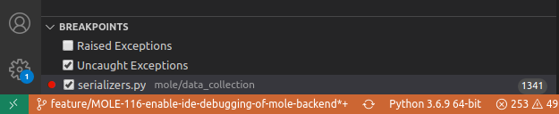

# **Debugger**

Debugging the Mole API backend can be simplified using an IDE debugger. Mole is distributed with a configuration for debugging under Visual Studio Code. This functionality makes use of the [debugpy](https://github.com/microsoft/debugpy) debugger for remote debugging within a Docker container: [https://code.visualstudio.com/docs/containers/debug-python](https://code.visualstudio.com/docs/containers/debug-python). Visual Studio Code uses the `.vscode/launch.json` file to configure the remote debugging session. This file is included in the Mole repository, so no added steps should be necessary to use it.

In order to run the debugger, the Gunicorn WSGI server must be started with a single process and the `debugpy` server must be started within it. These are accomplished by passing the `-d` parameter to either `./ml init` or `./ml run` (e.g., `./ml run -d`)

!!! tip "Note"
    In debug mode, Django will not serve pages until a debugger client has connected.

When run with `-d`, once all containers have started, the Django server waits for a debugger client to "attach". In order to attach the Visual Studio Code debugger, click on Run -> Start Debugging and select "Django: Remote Attach" or click on the Run/Debug icon in the side panel and click the green play icon (`Start Debugging`) with "Django: Remote Attach" selected from the pull-down.

*Attach to the debugger using the green play icon with "Django: Remote Attach" selected from the pull down.*

When the debugger client has successfully attached to the debugger server within the container, the bar at the bottom of the Visual Studio Code window may turn from blue to orange (depending on the theme in use). Additionally, the Mole terminal output indicates `Debugger client attached. Continuing.` when the debugger is successfully attached.

*Visual Studio Code debugger not attached*

*Visual Studio Code debugger attached*

From here all Visual Studio Code Debugger functionality is available including the following:

* breakpoints
* logpoints
* step through / into / over
* data inspection
* watch expressions
* debug console
  
For an introduction to setting breakpoints and working with the Visual Studio Code debugger, see [https://code.visualstudio.com/docs/python/python-tutorial#_configure-and-run-the-debugger](https://code.visualstudio.com/docs/python/python-tutorial#_configure-and-run-the-debugger). More in depth documentation on working with the Visual Studio Code debugger can be found here: [https://code.visualstudio.com/docs/editor/debugging](https://code.visualstudio.com/docs/editor/debugging)